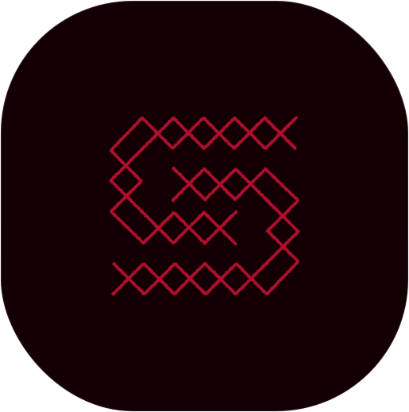

<p align="center">
  
</p>

<h1 align="center">Stiches</h1>

<p align="center">A modern Next.js template with beautiful animations and a comprehensive UI component library.</p>

<br>

## 🚀 Tech Stack

- **[Next.js 16](https://nextjs.org/)** - React framework with App Router
- **[React 18](https://react.dev/)** - UI library
- **[HeroUI v2](https://heroui.com/)** - Component library (React 18 compatible)
- **[Tailwind CSS 4](https://tailwindcss.com/)** - Utility-first CSS framework
- **[Motion](https://motion.dev/)** - Animation library (successor to Framer Motion)
- **[TypeScript 5.6](https://www.typescriptlang.org/)** - Type safety
- **[Bun](https://bun.sh/)** - Fast JavaScript runtime and package manager
- **[React Icons](https://react-icons.github.io/react-icons/)** - Icon library
- **[next-themes](https://github.com/pacocoursey/next-themes)** - Dark mode support

## 📁 Project Structure

```
stiches/
├── app/                    # Next.js App Router pages
│   ├── layout.tsx         # Root layout with providers
│   ├── page.tsx           # Home page
│   ├── providers.tsx      # Theme and UI providers
│   └── void/              # Void page
├── components/            # React components
│   └── ...
├── config/                # Configuration files
│   ├── fonts.ts          # Font definitions
│   └── site.ts           # Site metadata and navigation
├── consts/               # Constants
│   └── primitives.ts     # tailwind variants premitives
├── public/               # Static assets
│   └──...
├── styles/               # Global styles
│   └── globals.css       # Tailwind directives and custom styles
├── types/                # TypeScript type definitions
├── .env.example          # Environment variables template
├── .prettierrc           # Code formatting config
├── eslint.config.mjs     # ESLint configuration
├── next.config.js        # Next.js configuration
├── postcss.config.js     # PostCSS configuration
├── tsconfig.json         # TypeScript configuration
└── tailwind.config.mjs   # Tailwind configuration
```

## ✨ Features

- **Motion Animations**: Smooth, performant animations with spring physics, hover effects, and keyframe animations
- **React Icons**: Access to 50,000+ icons from Heroicons, Font Awesome, Simple Icons, Material Design, and more
- **Tailwind CSS 4**: Utility-first styling with custom color scheme, responsive design, and dark mode support
- **Tailwind Variants**: Type-safe variant management with predefined design system primitives
- **HeroUI Components**: Comprehensive React component library with pre-built, accessible, theme-aware components
- **Theme Support**: Dark and light mode with seamless transitions using next-themes
- **Type Safety**: Full TypeScript coverage with strict mode
- **Modern Tooling**: Bun for fast installs and development

## 🛠️ Getting Started

### Prerequisites

- [Bun](https://bun.sh/) installed on your system

### Installation

1. Create a new project using this template:

```bash
bunx create-next-app -e https://github.com/HxX2/stiches
```

2. Copy environment variables (optional):

```bash
cp .env.example .env
```

3. Run the development server:

```bash
bun dev
```

4. Open [http://localhost:3000](http://localhost:3000) in your browser

## 📝 Available Scripts

- `bun dev` - Start development server
- `bun build` - Build for production
- `bun start` - Start production server
- `bun lint` - Run ESLint with auto-fix

## 🎨 Customization

### Colors

The project uses a custom color scheme with `secondary` (#B10F2E) as the brand color. Modify colors in `tailwind.config.mjs`.

For comprehensive theme customization, use the [HeroUI Theme Builder](https://www.heroui.com/themes) to generate a complete color palette and design system for your entire team.

### Fonts

Fonts are configured in `config/fonts.ts`. The project uses system fonts with fallbacks.

### Animations

The project uses [Motion](https://motion.dev/) for animations. Here are common patterns:

**Basic animation:**

```tsx
import { motion } from "motion/react";

<motion.div animate={{ x: 100, opacity: 1 }} transition={{ duration: 0.5 }}>
  Content
</motion.div>;
```

See [Motion documentation](https://motion.dev/docs) for advanced animations and API reference.

### React Icons

To add new icons from the React Icons library:

1. Import the icon from the desired icon pack:

```tsx
import { HiSparkles, HiBolt } from "react-icons/hi2"; // Heroicons 2
import { SiGithub, SiDocker } from "react-icons/si"; // Simple Icons
import { FaReact, FaNodeJs } from "react-icons/fa"; // Font Awesome
```

2. Use the icon component with optional props:

```tsx
<HiBolt size={24} className="text-primary" />
```

See [React Icons documentation](https://react-icons.github.io/react-icons/) for the complete icon library.

## 📦 Component Library

The project uses HeroUI v2 components including:

- Navbar, Button, Card, Input
- Modal, Dropdown, Tooltip
- Badge, Avatar, Progress
- And many more...

See [HeroUI documentation](https://heroui.com/docs) for full component list.

## 🔧 Configuration Files

- **next.config.js** - Next.js configuration
- **tailwind.config.mjs** - Tailwind CSS customization
- **tsconfig.json** - TypeScript compiler options
- **eslint.config.mjs** - Linting rules
- **.prettierrc** - Code formatting rules

## 📄 License

Licensed under the [MIT license](LICENSE).

## 🤝 Contributing

Contributions are welcome! Feel free to open issues or submit pull requests.

## 🔗 Links

- [GitHub Repository](https://github.com/HxX2/stiches)
- [Next.js Documentation](https://nextjs.org/docs)
- [HeroUI Documentation](https://heroui.com/docs)
- [Tailwind CSS Documentation](https://tailwindcss.com/docs)
- [Bun Documentation](https://bun.sh/docs)
- [React Icons](https://react-icons.github.io/react-icons/)
- [Motion Documentation](https://motion.dev/docs)
- [TypeScript Documentation](https://www.typescriptlang.org/docs/)
